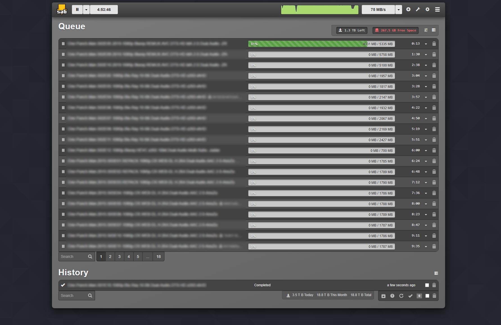

# MyGlitter — Guapo Theme for SABnzbd

A dark theme for SABnzbd's Glitter interface.



## Installation

1. Inside your SABnzbd installation folder, create:
   ```
   interfaces/Glitter/templates/static/stylesheets/guapo/
   ```
   and copy `custom.css` and `dark-pattern.png` into it.

2. Copy `main.tmpl` to:
   ```
   interfaces/Glitter/templates/main.tmpl
   ```
   (overwrite the existing file)

3. Restart SABnzbd.

## Updating SABnzbd

`custom.css` and `dark-pattern.png` are in a `guapo/` subfolder SABnzbd doesn't touch, so they survive updates. Only `main.tmpl` gets overwritten — re-copy it after upgrading.
